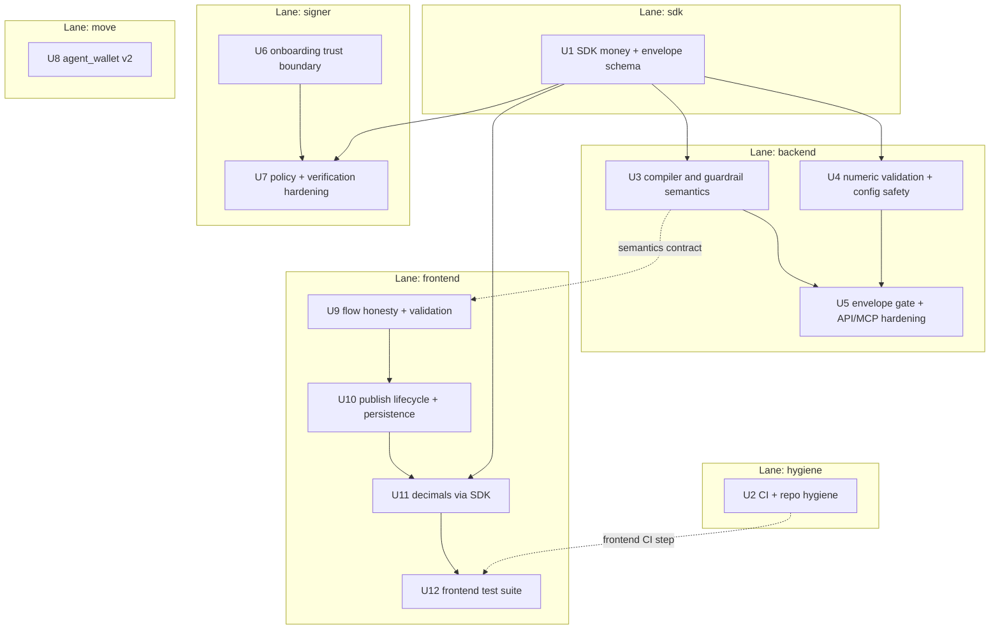
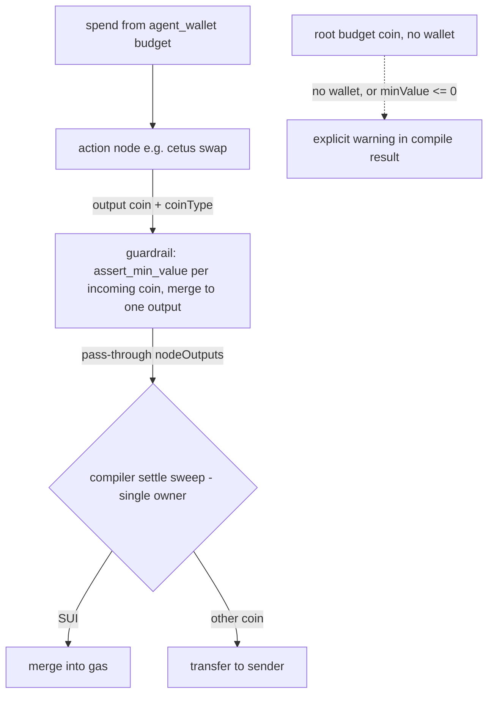

# Audit Hardening Sweep - Plan

## Goal Capsule

- **Objective:** Resolve the 2026-07-17 three-agent audit findings across backend, frontend, signer, Move contracts, and CI so that every safety claim Rill makes (guardrails, bounded signing, simulation gating) is actually enforced, and the money-handling path is precise and validated.
- **Authority:** This plan > repo conventions > implementer preference. Absolute constraint from `rill-frontend/AGENTS.md` (Lovable): never force-push, rebase, amend, or squash commits that are already pushed. All work stays local; pushing is the user's call.
- **Execution profile:** `ce-work` with Sonnet implementer subagents per unit; the orchestrator reviews every diff, runs the verification suites, and owns commits. One commit per workstream lane (hygiene/CI, sdk, backend, signer, move, frontend). Within the backend lane, U3 lands before U4 (both edit `rill-backend/src/http/schemas/api.schema.ts`; U3 owns the schema's structural changes, U4 adds field refinements after).
- **Stop conditions:** (a) a test suite cannot be made green without expanding scope beyond this plan, (b) a fix would require mutating on-chain state or holding a private key, (c) a finding turns out to be wrong in a way that changes a Key Technical Decision — stop and surface rather than guess.
- **Tail ownership:** Branch `fix/audit-hardening-sweep` off `develop`, commits local, **no push, no PR** — hand back to the user with a summary, the deferred-items list, and the user-owned post-sweep gate (live DeepBook re-rehearsal, below). If review time is short, the handoff summary directs the user to review the security-critical lanes first (sdk, backend, signer, move) before the frontend/hygiene lanes.

---

## Product Contract

### Summary

The audit found that Rill's core safety story is partially theater: guardrails drawn on the canvas are silently dropped or compile into no-ops, the recommended guarded wiring produces transactions that always abort on-chain, the MCP server hands out execution envelopes even when simulation failed, and the local signer blind-signs backend-supplied onboarding transactions. Amount handling assumes 9 decimals for every token and rides on float math in three inconsistent places. CI runs almost none of the existing 152 tests. This plan fixes all of that in one hardening sweep, choosing the honest option (block or label unsupported paths) wherever a finding requires a product decision.

### Problem Frame

Rill's pitch is "an agent can transact without risking the whole wallet" — enforced by compile-time guard injection, a policy-checked local signer, and on-chain chokepoints. Each of those three layers currently has verified gaps (audit of 2026-07-17: 15 backend, 15 frontend, 15 signer/SDK findings plus Move/CI review). Shipping demos on top of silent no-op guardrails risks real user funds and the product's credibility; the fixes are known, located to file and line, and mostly mechanical.

### Requirements

**Guardrail and compile honesty**

- R1. Every guardrail the canvas shows is either enforced in the compiled PTB or visibly reported as not applicable — no silently dropped edges, no silent no-op guards, including a guardrail whose `minValue` is unset or zero.
- R2. Every compiled PTB consumes all coins it produces; terminal `Action → Guardrail` wiring executes successfully (guardrail passes the coin through; the compiler settles leftovers).
- R3. The MCP skill runner refuses to return an `ExecutionEnvelope` when strict simulation failed — unconditionally, with no bypass field. The Cetus testnet devInspect fallback stays a `/simulate`-path classification (matched by package + module, not substring) surfaced as `verification: 'unverified'`; the signer's own fail-closed re-simulation gate is preserved and pinned by test.
- R4. Publish eligibility is computed up-front in the builder with truthful copy; capability text comes from one shared constant.

**Money and precision**

- R5. All token-amount conversion goes through one shared string/BigInt path with per-coin decimals from a token registry; invalid amounts are rejected, never silently defaulted.
- R6. Untrusted numeric config never reaches raw `BigInt()`/`Number()`; malformed input produces a validation error (422/inline), not a 500 or crash.
- R7. Backend config fails fast: mainnet without a guard package refuses to start; `min_amount_out` has no 1-mist default; the default network is testnet.

**Signer trust boundary**

- R8. The signer never signs backend-supplied bytes without structural policy inspection — including onboarding (`create_run_set` setup/trade-cap PTBs); onboarding auto-execution cannot be enabled from the agent-facing MCP surface, only via environment at launch.
- R9. After re-simulation the signer checks effects: sender balance outflow beyond `spendAmountMist` plus a gas bound is rejected.
- R10. Policy enforces independent ceilings: `maxAmountMist` as a hard cap regardless of run-set `demoParams`, a mandatory gas ceiling, live-wallet `expires_at_ms`/`per_tx_max` checks before signing, and `typeArguments` validation for allowed targets.
- R11. Run-sets load only through strict schema validation (address shape, u64 decimal strings) and refuse group/other-writable or symlinked files; the exact bytes signed must hash to `actionDigest`.

**Move contracts**

- R12. `agent_wallet` v2 adds a rolling spend-window quota, `sender == agent` enforcement, and owner-controlled cap rotation plus expiry/per-tx setters — fully unit-tested; deployment is deferred ops work.

**API hardening**

- R13. Flow input is structurally validated: unique node IDs, existing edge endpoints, known handle names, Sui-address regexes; publish is capped (flow size, stored-skill count — reject new publishes at capacity, no eviction) and RPC pagination is bounded.
- R14. The MCP endpoint handles JSON-RPC batch and id-less requests per spec and validates Origin by exact match against an explicit allowlist — never substring or prefix matching.
- R15. `/audit` responses are schema-validated, size-capped, and error-sanitized; `/introspect` returns an honest 501; `/resolve` dead code is removed and the curated manifest points at `router::swap`.

**Frontend resilience**

- R16. Builder state survives refresh (debounced draft autosave + validated, versioned restore) and the last publish result is recoverable; publish is an explicit, idempotent action — never an effect that fires on dialog mount.
- R17. Wire constraints update node data visibly with a notice instead of silently rewriting values at compile time; skipped nodes *and edges* are reported in the simulate and export dialogs.
- R18. All frontend API calls time out and abort on unmount.

**Tests, CI, hygiene**

- R19. CI runs all workspace test suites (including the new frontend suite), the frontend build, and Move tests on pull requests and pushes to `develop`/`main`.
- R20. New unit tests cover: flow-mapper edge semantics, amount conversion, cetus adapter coin-consumption invariant, guardrail compile paths (including unset `minValue`), topological-sort cycles, hostile-envelope and hostile-onboarding rejections, run-set tampering.
- R21. Repo hygiene: stray `rill/` clone removed, dead `SUBMISSION.md` link fixed, `rifuki.dev` rewrite removed, stale capability copy and dead links fixed, `ExecutionEnvelope` defined once as a Zod schema with derived type + validator + contract test.

### Scope Boundaries

**Deferred to Follow-Up Work**

- Deploying `agent_wallet` v2 to testnet and updating package IDs in env/docs/run-sets (requires user keys and gas; v2 changes struct layout, so it is a fresh package, not an in-place upgrade).
- Live on-chain rehearsal of Cetus swap and Haedal stake.
- Builder-side agent-wallet acquisition (an input, lookup, or onboarding hand-off that gives the builder a real `agentWallet` object id). Until it exists, simulate/publish honestly take the no-wallet warning branch (U9).
- Skills management page (list/revoke published skills) and any publish authentication/API keys beyond the existing Traefik edge rate limit.
- Making the PTB node a real transaction boundary; guarding a budget coin flowing *into* a downstream action (design work).
- Mobile/touch builder support beyond an honest "best on desktop" experience.
- Bundling token logo assets locally (`protocol-logo.tsx` already has an `onError` broken-state fallback; nothing further this sweep).

**Outside this product's identity**

- Holding user keys server-side in any form; auto-executing anything without a local policy check.

---

## Planning Contract

### Key Technical Decisions

- **KTD-1 — Honest behavior over new capability.** Where a finding needs a product call, block or label rather than build: publish stays DeepBook-only but the gate is computed up-front with truthful copy; the simulate dialog's fake guardrail toggles are replaced by a read-only display of what is actually enforced (the guardrail node's `minValue` and the agent-wallet caps). Rationale: expanding publish to untested flows would trade one dishonesty for another.
- **KTD-2 — One money path in the SDK.** `@rill/sdk` gains a token registry (`{coinType, symbol, decimals}`), `decimalToBaseUnits(value, decimals): bigint` (string math, no floats), and `parseU64String`. Backend, frontend, and signer all consume these. The three divergent float conversions and the float-tolerance policy comparison are the root cause of five findings.
- **KTD-3 — Guardrail becomes pass-through + compiler-owned settle sweep.** The guardrail adapter records its input coin as its own output, and the compiler ends every build with a settle sweep over unconsumed outputs. The sweep is the *single owner* of no-downstream-consumer settlement: the inline settle-on-no-downstream branch moves out of `cetus.adapter.ts` so no coin is ever settled twice. `nodeOutputs` entries carry `{value, coinType}` so the sweep can branch merge-into-gas (SUI) vs transfer-to-sender (other coins); a multi-input guardrail asserts each incoming coin then merges them into one output coin, keeping one coin per node. Unguardable wiring — and a guardrail whose `minValue` resolves ≤ 0 — produces an explicit warning in the compile result instead of a silent `continue`.
- **KTD-4 — Unconditional server-side envelope gate; the Cetus fallback stays on `/simulate`.** `runFlow` (which structurally serves only the DeepBook hero path — it rejects any flow that is not exactly one `deepbook_limit_order` before compiling) refuses to emit an envelope when `simulation.ok === false`, with no carve-out and no bypass field: Cetus flows can never reach it, so an envelope-level `simulationGate` would be dead code solving a non-problem. The Cetus devInspect fallback classification stays where it lives today — `simulator.service.ts` on the `/simulate` path — upgraded to match the Cetus package + `checked_package_version` module rather than a substring, still surfaced as `verification: 'unverified'` in responses and dialogs. The envelope schema gains no new field, and the signer's fail-closed re-simulation gate is untouched and newly pinned by a hostile-fixture test (U7).
- **KTD-5 — Onboarding is env-gated and independently inspected.** `autoCreateRunSets` can only be enabled by `RILL_ALLOW_AUTO_ONBOARDING=true` at process launch; `set_onboarding_config` loses the ability to flip it. Setup PTBs pass a *new, independent* `inspectOnboarding()` in `policy.ts` — written in the same command-walking style as `inspect()` but sharing no code with it, since `inspect()` is a hardcoded validator for the DeepBook envelope sequence that R9–R11 already depend on. The onboarding allowlist: only `agent_wallet::create_wallet` / DeepBook balance-manager + trade-cap targets, budget ceiling, no transfers to addresses other than sender/agent. The trade-cap PTB is built locally from a template instead of string-patching backend bytes. The documented rehearsal steps in `docs/e2e-testing-guide.md` are updated to name the env precondition.
- **KTD-6 — Move v2 is a new package.** Adding window-quota and cap-rotation fields changes `AgentWallet`'s layout, which Sui upgrade rules forbid in-place; land code + tests now, deploy later as ops work. A dynamic-field attachment could add state under a compatible upgrade instead, but the repo has no dynamic-field precedent and the flat-struct v2 is simpler to test and audit — accepted trade-off. Keep entry-point names stable so downstream config only swaps package IDs.
- **KTD-7 — Fail-fast config.** `config.ts` throws at startup on `mainnet` without `RILL_GUARD_PACKAGE_ID`; default network becomes `testnet`; `skillsStorePath` resolves relative to the backend package root, not cwd.
- **KTD-8 — Branching under Lovable constraints.** All work on `fix/audit-hardening-sweep` off `develop`; commits are additive and local; no history rewriting; no push without the user.

### Assumptions

- Removing the runtime `set_onboarding_config` enable path is an acceptable breaking change for a demo-stage tool (R8); pre-existing local `.rill/runsets/*.json` files created under the looser schema may need regeneration via `create_run_set` after U7 lands.
- DeepBook-only publish is the current product truth; Cetus→Haedal stays simulate-only until live-tested (KTD-1).
- Testnet-default network is safe for every current deployment (production compose sets env explicitly).
- The session-local audit reports in this conversation are the finding source of record; file:line references were re-verified by implementers before editing.

### High-Level Technical Design

Unit dependency and lane structure. Solid arrows are hard, blocking dependencies; the dashed U3→U9 edge is a non-blocking semantics contract (U9 can start first; its wire rules must agree with U3's compile semantics before the frontend lane commit lands):

Fixed guardrail compile path (directional, not implementation spec):

---

## Implementation Units

| U-ID | Title | Key files | Depends on |
|---|---|---|---|
| U1 | SDK money + envelope foundation | `packages/rill-sdk/src/`, `packages/rill-sdk/test/` | — |
| U2 | CI + repo hygiene | `.github/workflows/ci.yaml`, `README.md` | — |
| U3 | Compiler + guardrail semantics | `compiler.service.ts`, `guardrail.adapter.ts`, `cetus.adapter.ts`, `haedal.adapter.ts`, `api.schema.ts` | U1 |
| U4 | Numeric validation + config safety | `config.ts`, `node-config.ts`, `api.schema.ts`, `skill-runner.service.ts`, `setup.service.ts` | U1, U3 (schema file) |
| U5 | Envelope gate + API/MCP hardening | `skill-runner.service.ts`, `mcp.service.ts`, `simulator.service.ts`, `api.routes.ts`, `audit.service.ts`, `introspect/`, `openapi.ts` | U3, U4 |
| U6 | Signer onboarding trust boundary | `mcp.ts`, `config.ts`, `policy.ts`, `docs/e2e-testing-guide.md` | — |
| U7 | Signer policy + verification hardening | `policy.ts`, `core.ts`, `runsets.ts`, `config.ts` | U1, U6 |
| U8 | agent_wallet v2 (code + tests only) | `move/agent_wallet/` | — |
| U9 | Frontend flow honesty + validation | `flow-mapper.ts`, `wire-inference.ts`, `builder.tsx`, `simulate-dialog.tsx`, `nodes.tsx`, `site-chrome.tsx`, `__root.tsx` | U3 (semantics contract, non-blocking) |
| U10 | Publish lifecycle + persistence | `builder.tsx`, `export-dialog.tsx` (new), `dialog-shell.tsx` (new), `use-flow-request.ts` (new), `draft-storage.ts` (new), `rill-api.ts`, `simulate-dialog.tsx`, `discover-dialog.tsx` | U9 |
| U11 | Frontend decimals via SDK | `action-config.ts`, `nodes.tsx` | U1, U10 |
| U12 | Frontend test suite | `rill-frontend/` (vitest), `.github/workflows/ci.yaml` | U2, U9–U11 |

### U1. SDK money + envelope foundation

- **Goal:** One shared, float-free money path and one canonical `ExecutionEnvelope` definition.
- **Requirements:** R5, R6, R20 (partial), R21 (envelope schema).
- **Files:** `packages/rill-sdk/src/tokens.ts` (new), `packages/rill-sdk/src/amounts.ts` (new), `packages/rill-sdk/src/envelope.schema.ts` (new), `packages/rill-sdk/src/execution-envelope.ts`, `packages/rill-sdk/src/types.ts`, `packages/rill-sdk/test/amounts.test.ts` (new), `packages/rill-sdk/test/envelope.schema.test.ts` (new — test files follow the package's existing `test/` directory convention).
- **Approach:** Token registry keyed by coin type with `decimals` for the coins Rill touches today (SUI, DBUSDC, testnet USDC, WAL as applicable — enumerate from backend `protocols.ts`). `decimalToBaseUnits` does decimal-string shifting into `bigint` and rejects malformed/negative/overflow/precision-loss input; `parseU64String` wraps it for integer fields. Define the envelope once as a Zod schema; derive the TS type via `z.infer`; keep `assertExecutionEnvelope`/`validateExecutionEnvelope` as thin wrappers and preserve the exported field-name constants (`EXECUTION_ENVELOPE_REQUIRED_FIELDS` etc.) that `rill-backend/src/http/openapi.ts` imports. The schema stays strict and gains no new fields (KTD-4).
- **Test scenarios:** `"1"` @9 → `1000000000n`; `"1.5"` @6 → `1500000n`; `"0.000000001"` @9 → `1n`; `"1e-10"` @9 rejected (precision loss); `"abc"`, `""`, `"-1"`, `"1.2.3"` rejected; value exceeding u64 rejected; a fixture envelope built by the backend validates; an envelope with one extra field fails (strict); tampering `resolvedParams` types fails.
- **Verification:** `bun test --cwd packages/rill-sdk` green; `bun run check:sdk` green; backend and signer type-check against the derived type.

### U2. CI + repo hygiene

- **Goal:** CI actually proves the repo; stray artifacts gone.
- **Requirements:** R19, R21 (partial).
- **Files:** `.github/workflows/ci.yaml`, `README.md`; delete untracked `rill/` directory.
- **Approach:** Extend CI to jobs: sdk (typecheck + test), backend (test), signer (test), frontend (build **and** `bunx vitest run` — the test step lands with U12 and this job must include it), move (both packages with the Sui CLI installed from a pinned MystenLabs/sui GitHub release binary or a pinned container image — there is no verified first-party GitHub Action; do not hunt for one). Trigger on `pull_request` and pushes to `develop` and `main`. Fix the dead `./SUBMISSION.md` README link (point at `docs/project-context.md` or drop it).
- **Test scenarios:** Test expectation: none — CI config + link fix; proven by the Verification Contract suites locally and by CI on the user's next push.
- **Verification:** Workflow YAML parses (actionlint if available); every suite named in the workflow passes locally.

### U3. Compiler + guardrail semantics

- **Goal:** Guarded wiring compiles into PTBs that succeed on-chain and never silently lose an edge or no-op a guard.
- **Requirements:** R1, R2, R13 (handle validation + pagination cap), R20 (partial).
- **Files:** `rill-backend/src/features/compiler/compiler.service.ts`, `rill-backend/src/features/protocols/guardrail.adapter.ts`, `cetus.adapter.ts`, `haedal.adapter.ts`, `ptb.adapter.ts`, `rill-backend/src/http/schemas/api.schema.ts`; tests `rill-backend/src/features/compiler/compiler.service.test.ts`, `rill-backend/src/features/protocols/guardrail.adapter.test.ts` (new), `cetus.adapter.test.ts` (new).
- **Approach:** Per KTD-3: `nodeOutputs` entries become `{value, coinType}`; guardrail asserts every incoming coin edge then merges multiple inputs into one output coin and records it (pass-through); the compiler's final settle sweep is the single owner of settlement (remove `cetus.adapter.ts`'s inline settle-on-no-downstream branch) — merge SUI into gas, transfer other coins to sender; root-budget guard path deduplicated so a guardrail is never double-processed. Warnings (structured, carried into compile/simulate responses): guardrail before action, guardrail with no wallet and no coin edge, and guardrail whose `minValue` resolves ≤ 0 — the last in both `guardrail.adapter.ts` and the `compiler.service.ts` root-budget loop. Cap `sourceCoinFromSender`'s pagination loop in `cetus.adapter.ts` (R13). Add a per-adapter registry of valid handle names; unknown source/target handles and duplicate node IDs / dangling edges fail Zod validation with 422 (this unit owns `api.schema.ts`'s structural changes; U4 adds refinements after). Unify the handle-specific consumption check with `feedsHaedal`-style detection so they cannot disagree.
- **Execution note:** Write the failing "terminal Action → Guardrail must compile to a self-consuming PTB" test first; it locks the core semantic.
- **Test scenarios:** Terminal swap→guardrail flow compiles with the guard call plus exactly one settle command per produced coin, and an "every produced coin is consumed exactly once" walker asserts zero dangling or double-consumed results; a bare terminal swap with no guardrail still compiles to exactly one settle per coin (sweep-ownership regression); swap→guardrail→stake keeps the coin flowing to the stake; two actions wired into one guardrail yields two asserts and one merged output; guardrail-before-action (no wallet) yields a warning and no guard command; guardrail with default/absent `minValue` yields a "no protection enforced" warning; duplicate node IDs → 422; edge to nonexistent node → 422; `targetHandle: "coin"` typo → 422 (and no double `spend()`); cycle in flow → 422 via topological-sort error; pagination cap honored when a sender has more coin pages than the cap.
- **Verification:** `bun test --cwd rill-backend` green including new tests.

### U4. Numeric validation + config safety

- **Goal:** Malformed input can no longer 500 the API or silently mis-fund; unsafe config cannot boot.
- **Requirements:** R5, R6, R7, R13 (address regexes).
- **Files:** `rill-backend/src/core/config.ts`, `rill-backend/src/core/node-config.ts`, `rill-backend/src/http/schemas/api.schema.ts`, `rill-backend/src/features/mcp/skill-runner.service.ts`, `rill-backend/src/features/setup/setup.service.ts`, touchpoints in `features/protocols/*.adapter.ts` and `features/compiler/compiler.service.ts`; tests `rill-backend/src/core/node-config.test.ts` (new/extend), `config.test.ts` (new).
- **Approach:** Replace every raw `BigInt(...)`/`Number(...)` over request-supplied config with SDK `parseU64String`/`decimalToBaseUnits` throwing `ValidationError` (→ 422). All three float→mist sites (`deepbook.adapter.ts`, `skill-runner.service.ts`, `setup.service.ts`) route through the SDK helper so round/ceil divergence disappears. `min_amount_out` loses its `'1'` fallback and becomes required when a Cetus swap has no guardrail deriving it. Config: default network `testnet`; startup throws on mainnet without guard package; `skillsStorePath` anchored to the backend package directory. Add Sui-address regex refinements (`/^0x[0-9a-fA-F]{1,64}$/` + normalized length) to schema id fields, and make the server-wallet fallback opt-in via explicit request flag.
- **Test scenarios:** `minValue: "1.5"` → 422 naming the field; `amount_in: "abc"` → 422; negative amounts → 422; `depositSui: NaN`-producing input → 422 not RangeError; mainnet without guard package → startup throws with actionable message; sender `"zz"` → 422; missing `min_amount_out` with no guardrail → 422 explaining the requirement; compile/simulate without `agentWallet` and without `useServerWallet` does not bind the operator's wallet.
- **Verification:** `bun test --cwd rill-backend` green; boot smoke: `SUI_NETWORK=mainnet` without guard id exits with the fail-fast error.

### U5. Envelope gate + API/MCP hardening

- **Goal:** The server stops advertising guarantees it doesn't enforce, and the public surface is bounded and spec-correct.
- **Requirements:** R3, R13 (caps), R14, R15.
- **Files:** `rill-backend/src/features/mcp/skill-runner.service.ts`, `rill-backend/src/features/mcp/mcp.service.ts`, `rill-backend/src/features/compiler/simulator.service.ts`, `rill-backend/src/http/routes/api.routes.ts`, `rill-backend/src/features/walrus/audit.service.ts`, `rill-backend/src/features/introspect/introspect.service.ts`, `rill-backend/src/features/introspect/resolver.service.ts`, `rill-backend/src/http/openapi.ts`; tests extend `rill-backend/src/features/mcp/*.test.ts`, `rill-backend/src/features/walrus/audit.service.test.ts` (new).
- **Approach:** Per KTD-4: `runFlow` returns a structured refusal whenever `simulation.ok === false` — no carve-out, no new envelope field. Separately, the Cetus devInspect-abort classifier in `simulator.service.ts` (which backs `/simulate`) switches from substring matching to Cetus package + `checked_package_version` module matching; `/simulate` keeps reporting `verification: 'unverified'` for that case. MCP route: detect `Array.isArray(body)` and map each entry; id-less non-notification → `-32600`; Origin validated by exact equality (full-origin or parsed-host exact match) against an explicit allowlist derived from `PUBLIC_BASE_URL` + localhost — never substring/prefix, mirroring the classifier fix. Publish caps: `flow.nodes.length` ≤ 20; stored skills ≤ configurable cap — at capacity, new publishes are rejected with an explicit at-capacity error (no eviction). `/audit`: Zod-validate `AuditRecord`, cap bytes read, sanitize errors to generic 404. `/introspect` → 501 `AppError`; delete resolver dead code (`throw/catch` block, unused imports, `pickSwapFunctionLegacy`, sloppy `includes` matching) and re-point the curated Cetus manifest at `router::swap`. Update OpenAPI to match all of the above.
- **Test scenarios:** Failed-simulation flow → refusal object, no envelope; Cetus-abort classifier: real Cetus `checked_package_version` abort → `unverified`, lookalike abort text from a different package → NOT classified as the fallback; JSON-RPC batch of two requests → array of two responses; `{jsonrpc, method}` without id → `-32600`; foreign Origin → 403; lookalike origin `http://notlocalhost.evil.com` → 403; 21-node flow publish → 422; skills cap reached → explicit at-capacity error, no eviction; oversized/malformed audit blob → generic 404, no raw error text; `/introspect` → 501 with stable code; OpenAPI contract test still passes against new shapes.
- **Verification:** `bun test --cwd rill-backend` green; manual curl smoke against `bun run --cwd rill-backend dev`: batch MCP request, failed-sim compile, `/introspect`.

### U6. Signer onboarding trust boundary

- **Goal:** The signer can no longer be talked into signing arbitrary onboarding bytes.
- **Requirements:** R8, R20 (partial).
- **Files:** `packages/rill-signer/src/mcp.ts`, `packages/rill-signer/src/config.ts`, `packages/rill-signer/src/policy.ts` (new independent `inspectOnboarding()`), `docs/e2e-testing-guide.md`; tests `packages/rill-signer/src/mcp.test.ts`, `policy.test.ts`.
- **Approach:** `autoCreateRunSets` resolves only from `RILL_ALLOW_AUTO_ONBOARDING` at launch (fail-closed parse: exact `"true"`, default false — matching the file's existing `RILL_ALLOW_MAINNET` precedent); `set_onboarding_config` can no longer enable it (drop the tool or restrict it to non-privileged display settings). Add `inspectOnboarding()` as a new, independent function in `policy.ts` — same command-walking style as `inspect()` but zero shared code, because `inspect()` is a hardcoded DeepBook-sequence validator that `validateExecutionEnvelope` (R9–R11) depends on and must not be destabilized. Onboarding allowlist: permitted MoveCall targets only (`agent_wallet::create_wallet`, DeepBook balance-manager creation, trade-cap mint), split/merge bookkeeping, budget ceiling, zero transfers to addresses other than sender/agent. Replace `patchTradeCapPtb` string-patching with a locally built PTB from known-safe template parameters. Update `docs/e2e-testing-guide.md`: the onboarding rehearsal now requires `RILL_ALLOW_AUTO_ONBOARDING=true` in the signer's launch environment.
- **Execution note:** Hostile-onboarding tests first (red → green): they define the boundary.
- **Test scenarios:** Setup PTB with an appended transfer to a foreign address → rejected; setup PTB with an unexpected MoveCall target → rejected; budget above ceiling → rejected; `set_onboarding_config {autoCreateRunSets:true}` → rejected/absent; env gate off → `create_run_set` returns instructions without signing; legitimate onboarding fixture → passes inspection and signs (env-gated path); existing `inspect()` tests untouched and green (no shared-code regression).
- **Verification:** `bun test --cwd packages/rill-signer` green; the documented rehearsal steps re-read end-to-end for accuracy.

### U7. Signer policy + verification hardening

- **Goal:** The envelope path enforces independent ceilings, live capability state, effects consistency, and byte-exact signing.
- **Requirements:** R9, R10, R11, R5 (comparison side), R20 (partial).
- **Files:** `packages/rill-signer/src/policy.ts`, `packages/rill-signer/src/core.ts`, `packages/rill-signer/src/runsets.ts`, `packages/rill-signer/src/config.ts`; tests `policy.test.ts`, `core.test.ts`, `runsets.test.ts`.
- **Approach:** Enforce `maxAmountMist` as a hard cap independent of `demoParams` equality. After dry-run, compute net sender balance deltas from simulation effects and reject when outflow exceeds `spendAmountMist + gasCeiling`. Validate MoveCall `typeArguments` against expected coin types carried in the run-set. Make the gas ceiling mandatory (policy/run-set default when env absent); the default must comfortably exceed the observed gas of the proven live DeepBook run (see the run-set's recorded digest) so the hardening cannot brick the one working path — generous default (e.g. 0.1 SUI), configurable down. `assertCapabilitiesActive` additionally reads `expires_at_ms` and `per_tx_max` and rejects pre-sign. Serialize the transaction once, assert the hash equals `actionDigest`, sign those exact bytes. Replace float-tolerance comparisons with BigInt equality via SDK helpers. Run-sets: strict schema (address regex, u64 strings, non-empty `allowedTargets`, network match), write files 0600, refuse group/other-writable or symlinked paths outside `.rill/runsets/`. Detect key scheme from the `suiprivkey1` bech32 flag so Secp256k1/Secp256r1 keys work; hold only the derived keypair after construction. Sanitize MCP error surfaces to stable rejection codes, verbose detail to stderr. The fail-closed simulation gate stays exactly as-is and gains a pinning test (KTD-4).
- **Test scenarios:** Envelope spend within `demoParams` but above `maxAmountMist` → rejected; envelope with `simulation.ok === false` or `verification !== 'verified'` → rejected (fail-closed gate pinned by hostile fixture); simulated outflow exceeding spend+gas bound → rejected; wrong `typeArguments` on an allowed target → rejected; gas budget above ceiling → rejected; expired wallet → rejected pre-sign; `per_tx_max` below spend → rejected; mutated bytes vs `actionDigest` → rejected; world-writable run-set file → load refused; symlinked run-set → refused; tampered run-set failing schema → refused; Secp256k1 key round-trips; a legitimate envelope fixture still signs.
- **Verification:** `bun test --cwd packages/rill-signer` green (79 existing + new).

### U8. agent_wallet v2 (code + tests only)

- **Goal:** On-chain caps that match the product story: rate-bounded, rotatable, owner-adjustable.
- **Requirements:** R12.
- **Files:** `move/agent_wallet/sources/agent_wallet.move`, `move/agent_wallet/tests/agent_wallet_tests.move`.
- **Approach:** Add rolling-window quota (`window_ms`, `window_max`, `window_start_ms`, `spent_in_window`) enforced in `spend()` with lazy window reset via `Clock`; assert `ctx.sender() == wallet.agent` in `spend()` (defense-in-depth alongside cap possession); track the active cap (`cap_id: ID`) so the owner can `rotate_agent` (mints a new cap, updates `agent` + `cap_id`; old cap aborts); owner setters `set_per_tx_max`, `extend_expiry`, `set_window`; events for rotation and config changes; new abort codes documented in module doc comments. This is a v2 package (layout change) — keep function names stable; deployment is deferred ops.
- **Test scenarios (sui move test):** Spends within window pass, exceeding `window_max` in-window aborts, window elapse resets quota; `spend` from a non-agent sender aborts even with the cap; old cap after rotation aborts, new cap works; setters succeed for owner and abort for non-owner; expiry extension re-enables spending; all 10 pre-existing agent_wallet scenarios still pass (updated constructors) — the Verification Contract's move-wide floor of 12 includes `rill_guard`'s 2.
- **Verification:** `cd move/agent_wallet && sui move test` green; `cd move/rill_guard && sui move test` still green.

### U9. Frontend flow honesty + validation

- **Goal:** What the canvas shows is what compiles; invalid wiring is rejected or reported at draw/simulate time.
- **Requirements:** R1 (frontend half), R4, R17, R21 (dead links/capability copy).
- **Files:** `rill-frontend/src/lib/flow-mapper.ts`, `rill-frontend/src/lib/wire-inference.ts`, `rill-frontend/src/routes/builder.tsx`, `rill-frontend/src/components/flow/simulate-dialog.tsx`, `rill-frontend/src/components/flow/nodes.tsx`, `rill-frontend/src/components/site-chrome.tsx`, `rill-frontend/src/routes/__root.tsx` (og:image lives here, not `index.tsx`).
- **Approach:** `buildFlowGraph` returns `skippedEdges` alongside skipped nodes; one shared warning-banner component (dismissible, listing each skipped node/edge by name) renders them identically in both simulate and export dialogs. `isValidWireConnection` rejects guardrail-as-source into actions with a toast explaining direction (Action → Guardrail is the supported shape, honest after U3); enforce max one incoming coin edge per target handle and reject cycles. `applyWireConstraints` becomes a pure function returning a change list `{nodeId, field, from, to}` (keeps it U12-testable); the calling component applies changes via `setNodes` and fires the explanatory toast — only when a computed value actually differs from the stored value, so repeat dialog opens are silent no-ops. The guardrail node's `minValue` becomes an explicit required input: default empty (not "0"), inline error when unset/≤ 0, blocking simulate/publish like U11's amounts. **agentWallet honesty:** the builder has no way to obtain an `agentWallet` object id in this sweep (no input or lookup exists — acquisition is deferred, see Scope Boundaries); simulate/publish therefore always take the no-wallet warning branch, and the read-only guardrail display must say so. That display replaces the fake toggle panel: it lists each guardrail node's enforced `minValue`/coin, and when the canvas has no guardrail node it shows an explicit empty state ("No guardrails on this flow — actions execute without a minimum-output floor") rather than a blank panel. Publish eligibility computed from the canvas up-front: button kept focusable via `aria-disabled="true"` (not native `disabled`) with the reason chip associated through `aria-describedby`; the two contradictory gate messages unify into one truthful capability constant shared with the simulate dialog. Fix dead footer GitHub link and the stale `og:image` in `__root.tsx`.
- **Test scenarios:** Covered in U12 (pure functions extracted for testability).
- **Verification:** `bun run --cwd rill-frontend build` green; manual smoke via dev server: draw guardrail-before-action → rejected with toast; simulate shows the skipped-edge banner for an unsupported edge; guardrail with empty `minValue` blocks simulate with an inline error; publish button reason readable via keyboard focus.

### U10. Publish lifecycle + persistence

- **Goal:** No accidental skill minting; no lost work or lost URLs; no unrecoverable broken drafts.
- **Requirements:** R16, R18, R21 (rifuki.dev removal).
- **Files:** `rill-frontend/src/routes/builder.tsx`, new `rill-frontend/src/components/flow/export-dialog.tsx`, new `rill-frontend/src/components/flow/dialog-shell.tsx`, new `rill-frontend/src/lib/use-flow-request.ts`, new `rill-frontend/src/lib/draft-storage.ts`, `rill-frontend/src/lib/rill-api.ts`, `rill-frontend/src/components/flow/simulate-dialog.tsx`, `rill-frontend/src/components/flow/discover-dialog.tsx`.
- **Approach:** Extract the inline ~290-line ExportDialog. `dialog-shell.tsx` composes the existing accessible primitive `rill-frontend/src/components/ui/dialog.tsx` (Radix: focus trap, Escape-to-close, ARIA) restyled to the current visual treatment — do not extract the hand-rolled `motion.div` overlay as-is. The shared `useFlowRequest` hook and shell are adopted by all three dialogs (export, simulate, discover) so timeout/abort behavior is uniform. Publish becomes an explicit button inside a review step; the result is cached per `buildFlowGraph` output hash — same hash reopens the same skill URL; a changed hash presents the flow as unpublished, requires a new explicit Publish click, and labels the previously shown URL as belonging to an earlier version. Draft persistence: debounced localStorage serialization of nodes/edges with a `schemaVersion` tag; restore on mount is wrapped in try/catch + shape validation — on mismatch or corruption, discard the draft and toast that it couldn't be restored (mirrors the `onDrop` JSON.parse guard) instead of crashing; `idRef` seeded from max restored id; `beforeunload` guard when dirty; last publish result persisted. In `rill-api.ts`: `AbortSignal.timeout(20_000)` on all requests, abort in effect cleanups, drop the `rifuki.dev` rewrite branch; timeout failures get distinct copy ("Rill API didn't respond in time — try again") so users know a retry is worthwhile. In `builder.tsx` (inline ExportDialog remnants): guard the `onDrop` `JSON.parse`, fix the `copy()` timeout leak.
- **Test scenarios:** Covered in U12 (graph-hash stability, draft round-trip incl. corrupted/mismatched-version blobs, id seeding); manual: refresh restores canvas; reopening export dialog reuses the URL; editing the flow then reopening shows "unpublished — flow changed"; killing the backend mid-simulate surfaces the timeout copy instead of an infinite spinner; Escape closes dialogs and focus is trapped while open.
- **Verification:** `bun run --cwd rill-frontend build` green; manual smoke passes.

### U11. Frontend decimals via SDK

- **Goal:** Amounts entered in the UI mean what they say for every token.
- **Requirements:** R5.
- **Files:** `rill-frontend/src/lib/action-config.ts`, `rill-frontend/src/components/flow/nodes.tsx`, `rill-frontend/package.json` (workspace dep on `@rill/sdk`).
- **Approach:** Replace `toMist` float math with SDK `decimalToBaseUnits` + token registry lookup by the node's selected coin type; invalid or non-positive input shows an inline field error and blocks simulate/publish instead of substituting a fallback. Because the offending node may be off-screen, the blocking toast names the node/protocol and pans/selects the canvas to it — an inline error alone is not discoverable on a multi-node canvas. (Token logo fallback already exists in `protocol-logo.tsx`; nothing to add.)
- **Test scenarios:** Covered in U12: 1 USDC @6 → `1000000n` (not `1000000000n`); `"0"` and `"abc"` block with error instead of defaulting; SUI 9-decimals path unchanged for existing fixtures.
- **Verification:** `bun run --cwd rill-frontend build` green.

### U12. Frontend test suite

- **Goal:** The pure money/flow logic that guards funds is pinned by tests, and CI runs them.
- **Requirements:** R20 (frontend slice), R19.
- **Files:** `rill-frontend/package.json`, `rill-frontend/vitest.config.ts` (new), `rill-frontend/src/lib/flow-mapper.test.ts` (new), `rill-frontend/src/lib/wire-inference.test.ts` (new), `rill-frontend/src/lib/action-config.test.ts` (new), `rill-frontend/src/lib/draft-storage.test.ts` (new), `.github/workflows/ci.yaml` (add the `bunx vitest run` step to the frontend job U2 created).
- **Approach:** Vitest (bun-compatible) with jsdom only where needed; test pure functions directly — no component snapshot ceremony.
- **Test scenarios:** Action→Guardrail edge kept and reported in graph; Guardrail→Action rejected by wire validation; `skippedEdges` populated for unsupported action↔action pairs; `applyWireConstraints` returns the correct change list and an unchanged flow returns an empty list (toast-dedup contract); cycle and duplicate-coin-edge rejection; guardrail `minValue` empty/zero blocks (validation predicate); decimals conversions per U11; invalid amount blocks; draft serialize/restore round-trip preserves ids and seeds `idRef` beyond max id; corrupted and version-mismatched draft blobs are discarded without throwing; graph-hash stable across node reordering, changed by config edits; publish-gate predicate truth table (DeepBook-only publishable, Cetus/Haedal simulate-only, empty flow blocked).
- **Verification:** `bunx vitest run` (or `bun test` if configured) green inside `rill-frontend`; the CI frontend job includes the step.

---

## Verification Contract

| Gate | Command | Applies to |
|---|---|---|
| SDK tests + types | `bun test --cwd packages/rill-sdk` · `bun run check:sdk` | U1 |
| Backend tests | `bun test --cwd rill-backend` | U3, U4, U5 |
| Signer tests | `bun test --cwd packages/rill-signer` | U6, U7 |
| Move tests | `cd move/agent_wallet && sui move test` · `cd move/rill_guard && sui move test` | U8 |
| Frontend build | `bun run --cwd rill-frontend build` | U9–U12 |
| Frontend tests | `bunx vitest run` in `rill-frontend` | U12 |
| Boot smoke | backend dev boot; curl compile/simulate fixture, MCP batch, `/introspect` 501 | U4, U5 |
| No-regression floor | pre-existing counts all green: backend 55, signer 79, sdk 6, move 12 (10 agent_wallet + 2 rill_guard) | all |
| Live DeepBook re-rehearsal | **user-owned, post-sweep**: re-run the existing testnet run-set end-to-end through the signer (requires the user's key + gas; cannot run in this session) | handoff |

Quality gates: no suite may lose a pre-existing passing test; every unit's new negative tests present; working tree clean after each lane commit; no push.

## Definition of Done

- All twelve units landed as local commits on `fix/audit-hardening-sweep` (one commit per lane: hygiene/CI, sdk, backend, signer, move, frontend).
- Every locally runnable Verification Contract gate green; boot smoke performed.
- The honest-behavior requirements are observable in the running app: skipped edges reported, publish gate truthful and reason accessible, guardrail display real (including its empty state and the no-wallet notice), refresh restores drafts, corrupted drafts degrade gracefully.
- Handoff summary restates: deferred items (Move v2 deployment, live Cetus/Haedal rehearsal, builder-side agent-wallet acquisition, skills management, publish auth), the user-owned live DeepBook re-rehearsal gate (the sweep rewrites every layer the proven path depends on — money conversion, compiler, config, signer ceilings — so the previously confirmed on-chain flow must be re-confirmed before the next demo), and lane-review priority (sdk/backend/signer/move first).
- No abandoned experimental code in the diff; no absolute paths introduced into docs; stray `rill/` clone gone.
- Branch not pushed; Lovable history constraints untouched.
