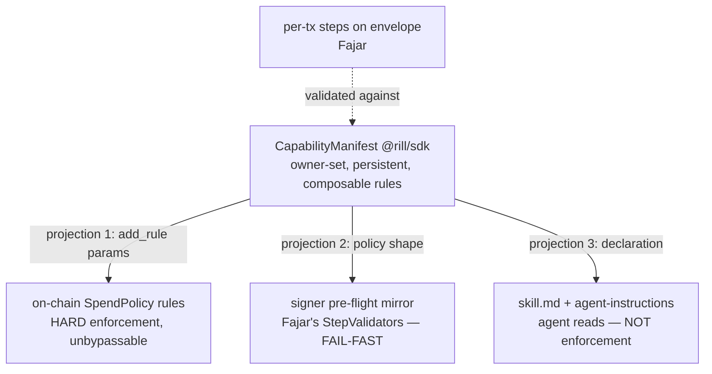
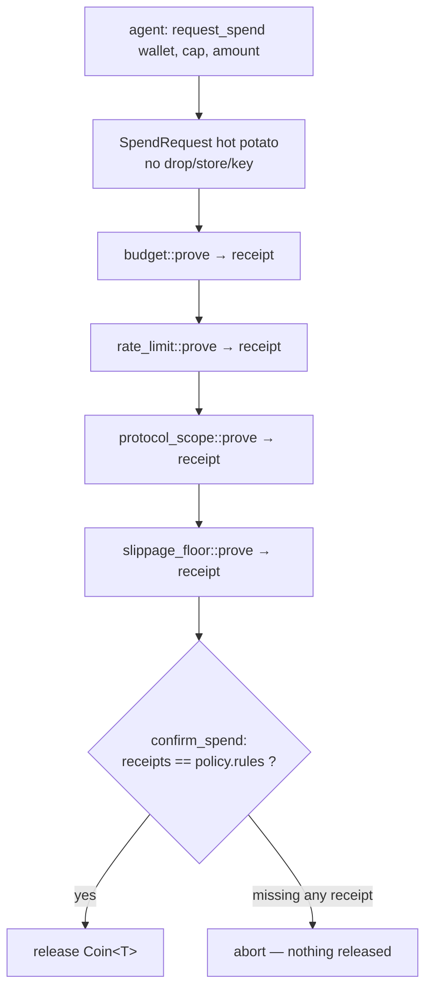
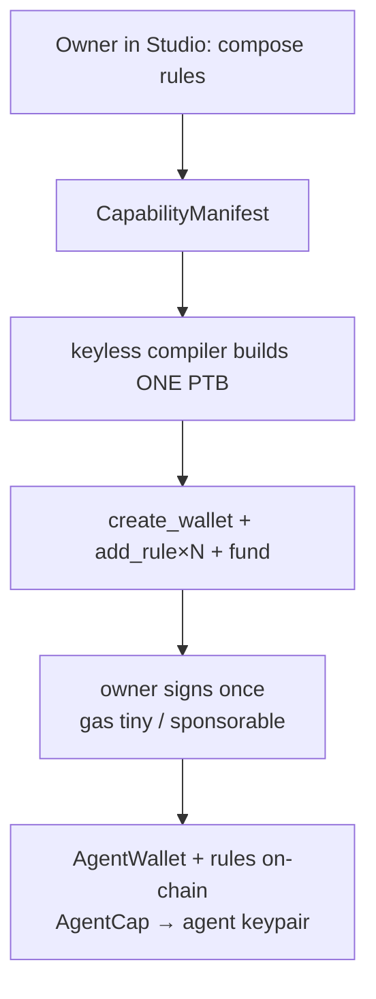

# Modular Agent-Wallet Capabilities - Plan

## Goal Capsule

- **Objective:** Make Rill's agent-wallet authority a **modular, pluggable set of restriction rules** (owner attaches/detaches "copot pasang"), enforced by code the untrusted agent cannot bypass, and drive the 5 demo-day tasks off a single `CapabilityManifest` that projects to three synchronized layers (on-chain, signer, agent-declaration).
- **Authority:** This plan > repo conventions > implementer preference. Lovable constraint (`rill-frontend/AGENTS.md`): never force-push/rebase/amend pushed commits. All work local; no push without the user.
- **Execution profile:** `ce-work` with Sonnet implementer subagents per unit; Fable orchestrates, reviews every diff, runs verification, owns commits. One commit per workstream. Branch `feat/rill-demo-day-agent-flow` (forked from teammate xfajarr's `feat/rill-demo-day-vertical-slice`).
- **Stop conditions:** (a) a unit collides with Fajar's live signer files (`packages/rill-signer/*`, rill-sdk envelope/steps) — stop and route to the coordination contract instead of editing his files; (b) a test suite can't go green without expanding scope; (c) a decision turns out to contradict a KTD — surface, don't guess.
- **Tail ownership:** Commits local, **no push, no PR**. Redeploying the Move package is deferred ops (needs the user's key + gas). FE work is deferred this pass. Hand back with a summary + the coordination-contract doc for Fajar.

---

## Product Contract

### Summary

Rill's agent wallet currently bounds an agent with hardcoded caps (budget, per-tx, expiry, window). That is not modular and not upgrade-safe. This plan redesigns the on-chain wallet to the Sui-idiomatic **Rule + Hot Potato** pattern (as used by Kiosk `TransferPolicy`): spending produces a `SpendRequest` hot potato that must clear every rule attached to a `SpendPolicy` before a coin is released. Rules are independent modules attached as dynamic fields, so the owner composes exactly the restrictions they want and the platform adds new rule types via in-place package upgrades (guarded by a `version.move`). A single `CapabilityManifest` in the SDK is the source of truth that projects to the three enforcement/declaration layers. The 5 demo-day tasks are built as facets of this one architecture, taking only the lanes that don't collide with teammate Fajar's live signer work.

### Problem Frame

The agent is untrusted — it can hallucinate any transaction. Safety cannot come from the agent behaving; it must come from restrictions the agent cannot bypass. Today those restrictions are hardcoded asserts in `agent_wallet::spend` — not composable, and adding a restriction type means editing the struct, which Sui package upgrades forbid, forcing a fresh redeploy each time. The product owner explicitly wants the production-grade pattern, not incremental patching. Simultaneously the studio's "output" (skill.md + MCP) doesn't yet hand the user a ready agent-instruction template, and the PTB node is a misleading visual-only artifact.

### Requirements

**Modular on-chain capability (the core)**

- R1. Spending is gated by the Rule + Hot Potato pattern: `request_spend` yields a non-droppable `SpendRequest`; `confirm_spend` releases the coin only if the request carries a receipt for every rule attached to the wallet's `SpendPolicy`.
- R2. Restriction rules are independent modules attached as dynamic fields keyed by a rule Witness; owner `add_rule<Rule>` / `remove_rule<Rule>`. The initial rule set: budget, per_tx, rate_limit (window), protocol_scope, slippage_floor, asset_scope, recipient_allowlist, time_window.
- R3. The package adopts the `version.move` gate (shared `Version` + `check_is_valid` on entry fns + Publisher-gated `migrate`) so new rule modules ship via in-place upgrade, never a forced redeploy; rules-as-dynamic-fields keep `AgentWallet` struct layout stable across upgrades.
- R4. The agent can NEVER change its own rules — `add_rule`/`remove_rule` and all setters are owner-only; the agent holds only an `AgentCap` that authorizes `request_spend` within the composed rules.

**Single source of truth**

- R5. A typed `CapabilityManifest` in `@rill/sdk` is the composable list of restriction rules and the single source that projects to: (1) on-chain `add_rule` params, (2) the signer pre-flight policy shape, (3) the skill.md + agent-instructions declaration.
- R6. The wallet-level `CapabilityManifest` (persistent, owner-set) is distinguished from the per-transaction `steps[]` on the envelope (Fajar's work); the signer validates per-tx `steps[]` against the manifest.

**Demo-day tasks**

- R7. (Task 1) PTB is the default and only transaction shape at the backend; the `ptb` adapter's warn-only visual-node handling is retired. Removing the PTB node from the studio UI is deferred (FE).
- R8. (Task 2) The compiler injects the `request_spend → rule.prove ×N → confirm_spend` sequence into the compiled PTB, derived from the manifest — composable guardrails/restrictions per action.
- R9. (Task 3) Onboarding is owner-driven: the owner assembles rules in the studio; the keyless compiler builds ONE PTB that calls `create_wallet + add_rule×N + fund` for the owner to sign once. The agent auto-creates only its local keypair (Fajar's keystore, done); on-chain wallet + rules are owner-set.
- R10. (Task 4) Publishing a skill emits a ready-to-paste **agent-instructions template**: how to add the rill-actions + rill-wallet MCP servers, the correct tool sequence, the active rules/caps declared honestly, and an example agent prompt.
- R11. (Task 5) Ship at least one additional high-value improvement surfaced during the work (candidate: a "capability preview" endpoint that renders a manifest to the three projections for review before publish).

**Deploy / cost model**

- R12. The platform deploys the Move package once (+ occasional upgrades to add rule types); users never deploy — attaching rules is a transaction (creating objects), not code. Onboarding is one PTB, one owner signature; gas is tiny and sponsorable (Enoki/Shinami) — designed so onboarding can be zero-SUI later.

### Scope Boundaries

**Deferred to Follow-Up Work**

- All frontend work: removing the PTB node, the studio rule-attachment UI, dark-theme/template-gallery redesign (separate design pass).
- Redeploying the redesigned Move package to testnet + propagating package IDs to env/docs/run-sets (needs the user's key + gas).
- Sponsored transactions (Enoki/Shinami gas station) wiring — designed-for now, implemented later.
- The signer-side layer-2 mirror implementation and owner-driven onboarding inside the signer's `create_run_set` — these live in Fajar's active files; this pass produces the interface contract only (U6), not the edits.
- Live on-chain rehearsal of the new spend flow.

**Outside this product's identity**

- Holding user keys server-side; letting the agent modify its own restrictions; enforcing money-safety anywhere the agent could bypass (all hard limits stay on-chain).

---

## Planning Contract

### Key Technical Decisions

- **KTD-1 — Rule + Hot Potato over hardcoded asserts.** Adopt Sui Kiosk's `TransferPolicy` rule pattern for spending: `request_spend` → `SpendRequest` (no `drop`/`store`/`key`) → each rule's `prove()` adds a Witness receipt after checking its invariant → `confirm_spend` asserts `receipts == policy.rules` and releases the coin. Rationale: unbypassable by construction (the hot potato must be confirmed; confirmation requires all receipts), composable, and extensible without touching the wallet struct. This *replaces* v2's hardcoded `spend()` asserts, which are neither composable nor upgrade-safe.
- **KTD-2 — Rules as dynamic fields, gated by version.move.** Each rule config attaches as a dynamic field on the `SpendPolicy` keyed by the rule Witness type (mirrors `transfer_policy::add_rule`). New rule *types* ship via in-place package upgrade; because rules are dynamic fields, `AgentWallet`/`SpendPolicy` struct layouts stay stable (Sui upgrade rules forbid changing existing struct fields). The `version.move` shared-`Version` + `check_is_valid` + Publisher-gated `migrate` pattern (ref: `Indonesia-Sui-Builder/narnia-realm/contract/sources/version.move`) coordinates the switch so old package versions are rejected post-migrate. Together: fully upgrade-safe, no forced redeploy.
- **KTD-3 — CapabilityManifest is the source, not a fourth layer.** One typed manifest in `@rill/sdk` → three projections that stay in sync: on-chain `add_rule` params (hard enforcement), signer pre-flight policy (fail-fast mirror), skill.md/agent-instructions (declaration). Owner edits the manifest once; projections regenerate. This is the contract that lets my on-chain rules and Fajar's step-validators be two projections of one truth rather than two divergent systems.
- **KTD-4 — Owner-driven onboarding; agent gets only a cap.** The owner (human, via studio Connect Wallet) signs the one-PTB onboarding (`create_wallet + add_rule×N + fund`). The agent auto-creates only its *local keypair* (Fajar's keystore). The `AgentCap` is issued to the agent's keypair. The agent can spend within rules but can never alter them. Rationale: if the agent owned/created its own wallet it could remove its own restrictions — the whole safety story collapses.
- **KTD-5 — Collision-avoidance partition.** Take only lanes Fajar isn't editing: `move/` (he's not there), `@rill/sdk` CapabilityManifest as a *new* module (not his envelope/steps files), `rill-backend/features/mcp/` (task 4), backend compiler-side of task 2, and backend task 1. The signer layer-2 mirror + signer onboarding are Fajar's files — produce an interface contract (U6) to hand him, do not edit them.
- **KTD-6 — Honest-behavior default.** Where a decision is needed, block/label rather than fake capability (continues the audit-sweep discipline). The agent-instructions template declares exactly the active rules — no aspirational claims.

### Assumptions

- The initial rule set (budget, per_tx, rate_limit, protocol_scope, slippage_floor, asset_scope, recipient_allowlist, time_window) covers demo needs; more rule types are added later via upgrade.
- The redesigned package is deployed fresh once (struct layout changed from the current live v1), then upgraded in-place forever after. Deployment is deferred ops.
- Fajar's `steps[]` envelope manifest and StepValidator registry are the intended per-transaction layer; the wallet-level `CapabilityManifest` is complementary, validated against per-tx steps at the signer. Final reconciliation happens through U6's contract, agreed with Fajar.
- `rill_guard::assert_min_value` remains the on-chain slippage primitive; the `slippage_floor` rule wraps/dispatches to it rather than reinventing it.

### High-Level Technical Design

**The one-source, three-projection model:**



**On-chain spend lifecycle (Rule + Hot Potato) — directional:**



**Owner-driven onboarding, one PTB, one signature:**



---

## Output Structure

New/changed layout (this pass; FE and deploy deferred):

```
move/agent_wallet/sources/
  agent_wallet.move          # redesigned: SpendPolicy + SpendRequest + request/confirm
  version.move               # new: shared Version gate + migrate
  rules/
    budget.move  per_tx.move  rate_limit.move  protocol_scope.move
    slippage_floor.move  asset_scope.move  recipient_allowlist.move  time_window.move
  agent_wallet.move tests    # rule composition + hot-potato adversarial

packages/rill-sdk/src/
  capability-manifest.ts     # new: typed manifest + validators + projection helpers

rill-backend/src/features/mcp/
  agent-instructions.ts      # new: template generator (task 4)

rill-backend/src/features/compiler/
  compiler.service.ts        # task 2: inject request_spend→prove×N→confirm ; task 1: PTB-default

docs/coordination/
  capability-manifest-contract.md   # new: interface for Fajar (signer mirror + onboarding)
```

---

## Implementation Units

| U-ID | Title | Key files | Depends on |
|---|---|---|---|
| U1 | Move: Rule + Hot Potato + version gate | `move/agent_wallet/sources/*` | U2 (rule-set agreement) |
| U2 | SDK CapabilityManifest + projections | `packages/rill-sdk/src/capability-manifest.ts` | — |
| U3 | Backend task 4: agent-instructions template | `rill-backend/src/features/mcp/` | U2 |
| U4 | Backend task 1: PTB-default, retire ptb node adapter | `rill-backend/src/features/compiler/`, `features/protocols/ptb.adapter.ts` | — |
| U5 | Backend task 2: compiler injects rule sequence | `rill-backend/src/features/compiler/compiler.service.ts` | U1, U2 |
| U6 | Coordination contract for Fajar (signer mirror + onboarding) | `docs/coordination/capability-manifest-contract.md` | U1, U2 |
| U7 | Task 5: capability-preview endpoint | `rill-backend/src/http/routes/`, `features/mcp/` | U2 |

### U1. Move: Rule + Hot Potato + version gate

- **Goal:** Replace hardcoded spend asserts with a composable, unbypassable, upgrade-safe rule system.
- **Requirements:** R1, R2, R3, R4, R12.
- **Files:** `move/agent_wallet/sources/agent_wallet.move` (redesign), `move/agent_wallet/sources/version.move` (new), `move/agent_wallet/sources/rules/{budget,per_tx,rate_limit,protocol_scope,slippage_floor,asset_scope,recipient_allowlist,time_window}.move` (new), `move/agent_wallet/tests/agent_wallet_tests.move` (rewrite/extend).
- **Approach:** Introduce `SpendPolicy` (holds a `VecSet<TypeName>` of attached rule witnesses; rule configs as dynamic fields keyed by witness, mirroring `sui::transfer_policy::add_rule`). `request_spend<T>(wallet, cap, amount, ...) : SpendRequest` — a hot potato (abilities: none) carrying spend metadata (amount, target package, coin_in/out types, recipient) and a `VecSet<TypeName> receipts`. Each rule module exposes `add(policy, owner_cap, cfg)` (owner-only attach) and `prove(&mut SpendRequest, &AgentWallet, ...)` that checks its invariant and calls `add_receipt<Rule>(req)`. `confirm_spend<T>(wallet, req) : Coin<T>` asserts `req.receipts == policy.rules` then releases the coin via `coin::take`. `version.move`: shared `Version{version}`, `check_is_valid` called at the head of every entry fn, `migrate(publisher, version)` Publisher-gated. Preserve entry-point *names* used by the SDK/signer where possible; `slippage_floor` dispatches to `rill_guard::assert_min_value`. Keep `AgentCap` owner-only for rule mutation (R4).
- **Execution note:** Write the "confirm_spend aborts when any attached rule has no receipt" adversarial test FIRST — it locks the unbypassable invariant.
- **Test scenarios (sui move test):** spend with all attached rules proven → coin released; spend missing one rule's receipt → aborts (nothing released); attach/detach a rule via owner cap changes what confirm requires; non-owner `add_rule`/`remove_rule` → aborts; budget rule blocks over-budget; per_tx blocks over-cap; rate_limit blocks over-window and resets after window; protocol_scope blocks a non-allowlisted target; slippage_floor rejects below-min (via rill_guard); asset_scope rejects wrong coin type; recipient_allowlist rejects foreign recipient; time_window rejects outside window; agent (non-owner) cannot mutate rules; `check_is_valid` aborts on a stale Version; `migrate` succeeds for Publisher, aborts for non-Publisher; a fresh rule type can be "attached" without changing the wallet struct (compile-level: adding a rule module doesn't touch `AgentWallet`).
- **Verification:** `cd move/agent_wallet && sui move test` green; `move/rill_guard` still green.

### U2. SDK CapabilityManifest + projections

- **Goal:** One typed source of truth that projects to all three layers.
- **Requirements:** R5, R6.
- **Files:** `packages/rill-sdk/src/capability-manifest.ts` (new), `packages/rill-sdk/src/index.ts` (barrel export), `packages/rill-sdk/test/capability-manifest.test.ts` (new).
- **Approach:** Define `CapabilityManifest` as a typed, composable list of restriction rules (discriminated union: budget/per_tx/rate_limit/protocol_scope/slippage_floor/asset_scope/recipient_allowlist/time_window, each with its params) — via a Zod schema (matching the SDK's existing schema style) so it validates and derives its TS type. Provide projection helpers: `toOnChainRuleParams(manifest)` (the `add_rule` argument shapes for U1's PTB assembly), `toSignerPolicy(manifest)` (the pre-flight shape Fajar's mirror consumes — SHAPE only, per U6 contract), `toDeclaration(manifest)` (a structured, human/agent-readable rendering U3 turns into skill.md/instructions). Keep it a NEW module — do not edit Fajar's envelope/steps files. Distinguish the wallet-level manifest from the per-tx `steps[]` in docs/types.
- **Test scenarios:** a manifest with each rule type validates; an unknown rule kind is rejected; duplicate rule kinds rejected (or merged — pick and test); `toOnChainRuleParams` yields the expected witness+config per rule; `toSignerPolicy` yields the agreed shape; `toDeclaration` yields the expected structured caps for every rule; round-trip (manifest → declaration) is lossless for the fields that matter; an empty manifest (no rules) is rejected as "no restrictions = unsafe" (honest default).
- **Verification:** `bun test --cwd packages/rill-sdk` green; `bun run check:sdk` green.

### U3. Backend task 4: agent-instructions template

- **Goal:** Publishing a skill emits a ready-to-paste agent-instructions block declaring the active capabilities.
- **Requirements:** R10, R6 (declaration side).
- **Files:** `rill-backend/src/features/mcp/agent-instructions.ts` (new), `rill-backend/src/features/mcp/skill-doc.ts` (wire into skill.md), `rill-backend/src/features/mcp/skill-runner.service.ts` or the publish route (attach to publish result), tests `rill-backend/src/features/mcp/agent-instructions.test.ts` (new).
- **Approach:** Generate a Markdown instructions template from the skill + its `CapabilityManifest` declaration (U2's `toDeclaration`): the two `claude mcp add` commands (rill-actions remote + rill-wallet stdio, public values only — reuse the README's exact env-safe form), the correct tool sequence (list_actions → describe_action → build_action → execute_rill_action), the active rules/caps declared honestly ("budget ≤ X, ≤ N/window, slippage floor Y, only these protocols…"), and an example agent prompt. Expose it on the publish result and at `GET /api/skills/:id/instructions.md` (alongside the existing skill.md). Zero collision with Fajar (backend `features/mcp/`).
- **Test scenarios:** a published DeepBook skill renders instructions containing both mcp-add commands, the 4-step tool order, and the exact active caps from its manifest; a skill with a rate_limit + slippage_floor manifest declares both honestly; a skill with no wallet/manifest declares the no-wallet honest state (reuse audit-sweep honest messaging); the instructions never leak private key material (assert denylist); `GET /instructions.md` returns the same content.
- **Verification:** `bun test --cwd rill-backend` green; curl `GET /api/skills/:id/instructions.md` on a dev-published skill.

### U4. Backend task 1: PTB-default, retire ptb node adapter

- **Goal:** PTB is the formal default; the visual-only PTB node handling is gone from the backend.
- **Requirements:** R7.
- **Files:** `rill-backend/src/features/protocols/ptb.adapter.ts`, `rill-backend/src/features/compiler/compiler.service.ts` (remove ptb-node special-casing), `rill-backend/src/features/protocols/types.ts` / handle registry if it lists a ptb handle, tests `rill-backend/src/features/compiler/compiler.service.test.ts`.
- **Approach:** The compiler already emits one PTB per flow. Remove the `ptb` adapter's warn-only "multiple PTB nodes" handling and any node-type branch that treats a ptb node specially; a flow with or without a (now-removed) ptb node compiles to the same single PTB. Keep backward tolerance: an incoming flow that still contains a `ptb` node from an old FE is accepted and ignored (not an error) so the deferred FE change can land later without breaking published flows. Document that PTB-default is now implicit.
- **Test scenarios:** a flow with no ptb node compiles to one PTB (unchanged); a flow that still includes a legacy ptb node compiles to the same PTB and does not warn/error; the removed special-casing leaves no dead branch (grep-level); pre-existing compiler tests still green.
- **Verification:** `bun test --cwd rill-backend` green.

### U5. Backend task 2: compiler injects rule sequence

- **Goal:** The compiled PTB carries the `request_spend → rule.prove ×N → confirm_spend` sequence, derived from the manifest — composable per-action restrictions.
- **Requirements:** R8, R1 (build side).
- **Files:** `rill-backend/src/features/compiler/compiler.service.ts`, `rill-backend/src/features/protocols/*.adapter.ts` (spend/settle seams touched by the audit sweep), tests `rill-backend/src/features/compiler/compiler.service.test.ts`.
- **Approach:** Where the compiler currently emits `agent_wallet::spend` (audit-sweep settle-sweep code), emit instead `request_spend` → for each rule in the flow's `CapabilityManifest` (U2), inject that rule module's `prove(...)` moveCall with params from `toOnChainRuleParams` → `confirm_spend`, then feed the released coin into the action as today. Guardrail/slippage becomes a `slippage_floor` rule prove-call (reconciling with the audit-sweep guardrail pass-through). Keep the "every produced coin consumed exactly once" invariant. This depends on U1's exact function names/signatures — treat those as the contract; if U1 isn't merged yet, gate behind the manifest and stub the targets from U1's declared entry points.
- **Execution note:** Extend the existing coin-consumption invariant walker to also assert exactly one `request_spend`/`confirm_spend` pair per spend and one `prove` per attached rule.
- **Test scenarios:** a manifest with 3 rules compiles a PTB containing request_spend + 3 proves + confirm_spend in order; a swap+guardrail flow injects the slippage_floor prove; a flow whose manifest rule set changes changes the injected proves; missing/invalid manifest → 422 (honest, don't emit an unguarded spend); the coin-consumption invariant still holds; no double request_spend.
- **Verification:** `bun test --cwd rill-backend` green.

### U6. Coordination contract for Fajar (signer mirror + onboarding)

- **Goal:** A precise interface doc so Fajar's signer layer-2 mirror and owner-driven onboarding align with the manifest + on-chain rules — without editing his files.
- **Requirements:** R5, R6, R9 (signer/onboarding side).
- **Files:** `docs/coordination/capability-manifest-contract.md` (new).
- **Approach:** Document, as an interface contract: (a) the `CapabilityManifest` shape (from U2) and `toSignerPolicy` projection Fajar's StepValidators consume; (b) how per-tx `steps[]` are validated against the wallet-level manifest at the signer (which rule maps to which step check); (c) the owner-driven onboarding flow — owner signs `create_wallet + add_rule×N + fund` (one PTB), agent auto-creates only the local keypair, `create_run_set` shifts from agent-driven wallet creation to consuming an owner-created wallet + issued AgentCap; (d) the on-chain entry-point names/signatures from U1 the signer must target. Frame as "propose to Fajar", list the exact files he'd touch (`policy.ts`, `steps/*`, `mcp.ts` create_run_set, `keystore.ts`) so ownership is explicit. No code.
- **Test scenarios:** Test expectation: none — a coordination doc; correctness is that it names the exact manifest shape, projection, per-step mapping, onboarding sequence, and U1 entry points, cross-checked against U1/U2 once those land.
- **Verification:** doc references resolve against U1 (entry points) and U2 (manifest/projection) after both are written.

### U7. Task 5: capability-preview endpoint

- **Goal:** Let the studio/owner preview a manifest's three projections before publishing (high-value, low-collision improvement).
- **Requirements:** R11.
- **Files:** `rill-backend/src/http/routes/api.routes.ts` (new route), `rill-backend/src/features/mcp/` or a small preview service, `rill-backend/src/http/schemas/api.schema.ts` (request schema), `rill-backend/src/http/openapi.ts`, tests `rill-backend/src/features/mcp/*preview*.test.ts` (new).
- **Approach:** `POST /api/capabilities/preview` takes a `CapabilityManifest`, validates it (U2), returns the three projections: the on-chain rule params (what add_rule calls will run), a human summary of the signer-enforced checks, and the agent-instructions declaration (U3). Read-only, no signing, no on-chain call — pure projection. This is the "see exactly what you're granting" surface that makes the copot-pasang model legible before the owner commits.
- **Test scenarios:** a valid manifest returns all three projections; an invalid/empty manifest → 422 with the honest "no restrictions" message; the declaration matches U3's generator; address/u64 fields validated (reuse audit-sweep schema refinements); the endpoint never signs or hits chain (assert no client calls).
- **Verification:** `bun test --cwd rill-backend` green; curl the endpoint with a sample manifest.

---

## Verification Contract

| Gate | Command | Applies to |
|---|---|---|
| Move tests | `cd move/agent_wallet && sui move test` · `cd move/rill_guard && sui move test` | U1 |
| SDK tests + types | `bun test --cwd packages/rill-sdk` · `bun run check:sdk` | U2 |
| Backend tests | `bun test --cwd rill-backend` | U3, U4, U5, U7 |
| Signer no-regression | `bun test --cwd packages/rill-signer` (must stay green — we don't edit it) | all (guard against accidental signer edits) |
| Manifest↔layers contract | a test that a fixture `CapabilityManifest` projects to matching on-chain params, signer shape, and declaration | U2 (+ cross-check U1/U3) |
| No-regression floor | current green counts: signer 187, sdk 64, backend 147, move agent_wallet 25 + rill_guard 2 | all |

Quality gates: no suite loses a pre-existing passing test; the signer suite stays green (proof we didn't collide with Fajar); working tree clean per commit; no push.

## Definition of Done

- U1–U7 landed as local commits on `feat/rill-demo-day-agent-flow` (one per workstream: move, sdk, backend-task4, backend-task1, backend-task2, coordination-doc, backend-task5).
- All locally runnable Verification Contract gates green; signer suite still 187 (untouched).
- The core capability model is demonstrable: a `CapabilityManifest` composes rules; the Move package enforces them via the hot-potato confirm; the compiler injects the sequence; the SDK projects to three layers; publishing emits honest agent instructions; the preview endpoint shows all three.
- U6 coordination doc handed off to Fajar (signer mirror + owner-driven onboarding), with exact manifest shape + U1 entry points.
- Deferred items restated in the handoff: FE (PTB-node removal, rule UI, redesign), Move redeploy + package-ID propagation, sponsored-tx wiring, signer-side mirror/onboarding implementation.
- No abandoned experimental code; no absolute paths in docs; branch not pushed; Lovable constraints untouched.
